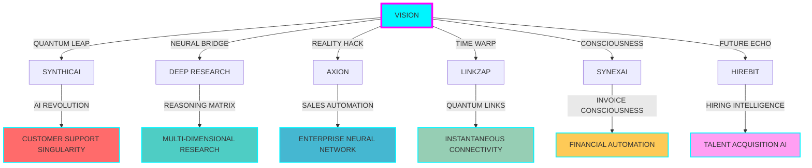

<div align="center">

```
████████╗██╗  ██╗███████╗    ███████╗██╗   ██╗████████╗██╗   ██╗██████╗ ███████╗
╚══██╔══╝██║  ██║██╔════╝    ██╔════╝██║   ██║╚══██╔══╝██║   ██║██╔══██╗██╔════╝
   ██║   ███████║█████╗      █████╗  ██║   ██║   ██║   ██║   ██║██████╔╝█████╗  
   ██║   ██╔══██║██╔══╝      ██╔══╝  ██║   ██║   ██║   ██║   ██║██╔══██╗██╔══╝  
   ██║   ██║  ██║███████╗    ██║     ╚██████╔╝   ██║   ╚██████╔╝██║  ██║███████╗
   ╚═╝   ╚═╝  ╚═╝╚══════╝    ╚═╝      ╚═════╝    ╚═╝    ╚═════╝ ╚═╝  ╚═╝╚══════╝
                                                                                  
    ██╗███████╗    ██╗  ██╗ █████╗ ██████╗ ███████╗██╗  ██╗██╗████████╗        
    ██║██╔════╝    ██║  ██║██╔══██╗██╔══██╗██╔════╝██║  ██║██║╚══██╔══╝        
    ██║███████╗    ███████║███████║██████╔╝███████╗███████║██║   ██║           
    ██║╚════██║    ██╔══██║██╔══██║██╔══██╗╚════██║██╔══██║██║   ██║           
    ██║███████║    ██║  ██║██║  ██║██║  ██║███████║██║  ██║██║   ██║           
    ╚═╝╚══════╝    ╚═╝  ╚═╝╚═╝  ╚═╝╚═╝  ╚═╝╚══════╝╚═╝  ╚═╝╚═╝   ╚═╝           
```

</div>

<div align="center">

```diff
@@ ARCHITECT OF ARTIFICIAL INTELLIGENCE ECOSYSTEMS @@
+ Building the infrastructure that powers tomorrow's autonomous world
- Traditional development paradigms? Obsolete.
! Reality: AI-First • Agentic • Autonomous • Anticipatory
```

</div>

<p align="center">
  
</p>

<div align="center">

```yaml
status: "BUILDING THE FUTURE"
location: "EARTH • METAVERSE • QUANTUM REALM"
mission: "ORCHESTRATING AI SYMPHONIES"
```

</div>

---

<div align="center">

# ⚡ NEURAL COMMAND CENTER ⚡

</div>

<table align="center">
<tr>
<td align="center" style="border: none;">

<br/>
<strong>HARSHIT DUGGAL</strong>
<br/>
<em>AI CONSCIOUSNESS ARCHITECT</em>
</td>
<td align="center" style="border: none;">

```ascii
    ╭─────────────────────────╮
    │    SYSTEM DIAGNOSTICS   │
    ├─────────────────────────┤
    │ ■ AI Models: ONLINE     │
    │ ■ Neural Nets: ACTIVE   │
    │ ■ Quantum Sync: STABLE  │
    │ ■ Innovation: ∞         │
    ╰─────────────────────────╯
```

</td>
</tr>
</table>

---

<div align="center">

# 🌌 REALITY DISTORTION FIELD 🌌

</div>

<div align="center">



</div>

<div align="center">

| 🚀 **PROJECT** | 🔮 **PARADIGM** | 🌟 **IMPACT RADIUS** | 📡 **STATUS** |
|:---:|:---:|:---:|:---:|
| **[SynthicAI](https://synthicai.com)** | `Customer Support Singularity` | **∞ CONVERSATIONS** | `🟢 LIVE` |
| **[Deep Research](https://blaze-labs.vercel.app)** | `Multi-Dimensional Reasoning` | **🧠 MIND EXPANSION** | `🟢 LIVE` |
| **[Axion](https://axionai.vercel.app)** | `Enterprise Neural Network` | **💼 SALES REVOLUTION** | `🟢 LIVE` |
| **[LinkZap](https://linkzap.vercel.app)** | `Quantum Link Architecture` | **⚡ INSTANT REALITY** | `🟢 LIVE` |
| **[SynexAI](https://synexai.in)** | `Invoice Consciousness` | **💰 FINANCIAL FREEDOM** | `🟢 LIVE` |
| **[HireBit](https://hirebit.site)** | `Talent Acquisition AI` | **🎯 PERFECT MATCHES** | `🟢 LIVE` |

</div>

---

<div align="center">

# ⚛️ QUANTUM TECH MATRIX ⚛️

</div>

<div align="center">

```ascii
╔═══════════════════════════════════════════════════════════════════════════════╗
║                            🧬 CORE DNA SEQUENCE 🧬                           ║
╠═══════════════════════════════════════════════════════════════════════════════╣
║  TypeScript → Rust → Go → Python → Assembly → Quantum → Neural Networks      ║
╚═══════════════════════════════════════════════════════════════════════════════╝
```

</div>

<table align="center">
<tr>
<td align="center">

**⚡ NEURAL INTERFACES**
```
┌─────────────────┐
│ Next.js 15.2    │◄─── Future Web
│ React 19        │◄─── Consciousness
│ Tailwind 4.0    │◄─── Style Matrix
│ Framer Motion   │◄─── Reality Bending
└─────────────────┘
```

</td>
<td align="center">

**🌐 QUANTUM BACKENDS**
```
┌─────────────────┐
│ Node.js         │◄─── Event Loops
│ Deno 2.0        │◄─── Secure Runtime
│ Bun             │◄─── Speed of Light
│ GraphQL/tRPC    │◄─── Data Telepathy
└─────────────────┘
```

</td>
</tr>
<tr>
<td align="center">

**🔮 DATA CONSCIOUSNESS**
```
┌─────────────────┐
│ PostgreSQL      │◄─── Relational Mind
│ MongoDB         │◄─── Document Soul
│ Redis           │◄─── Memory Palace
│ Vector DBs      │◄─── AI Memory
└─────────────────┘
```

</td>
<td align="center">

**🚀 DEPLOYMENT MATRIX**
```
┌─────────────────┐
│ Docker          │◄─── Containerized
│ Kubernetes      │◄─── Orchestrated
│ AWS/Vercel      │◄─── Cloud Native
│ Edge Computing  │◄─── Everywhere
└─────────────────┘
```

</td>
</tr>
</table>

<div align="center">

```diff
@@ AI & MACHINE CONSCIOUSNESS STACK @@
+ OpenAI GPT-4 Turbo ────────► Language Understanding
+ Claude 3 Opus ─────────────► Reasoning Engine
+ TensorFlow/PyTorch ────────► Neural Architecture
+ LangChain/LlamaIndex ──────► AI Orchestration
+ Vector Databases ──────────► Memory Systems
+ Custom Training Pipelines ─► Domain Expertise
+ MLOps & Model Versioning ──► Production AI
+ Agentic Frameworks ────────► Autonomous Systems
```

</div>

---

<div align="center">

# 📊 SYSTEM PERFORMANCE METRICS 📊

</div>

<table align="center">
<tr>
<td align="center">

</td>
<td align="center">

</td>
</tr>
</table>

<div align="center">

</div>

<div align="center">

```ascii
╔══════════════════════════════════════════════════════════════════════════════╗
║                           🏆 ACHIEVEMENT MATRIX 🏆                          ║
╠══════════════════════════════════════════════════════════════════════════════╣
║  🎯 AI Systems Deployed: 6+ Production Systems                              ║
║  🚀 Lines of Code: 500K+ (And counting...)                                  ║
║  ⚡ Performance: Sub-100ms API responses                                     ║
║  🧠 AI Models: 50+ Custom trained models                                    ║
║  🌍 Global Reach: 10K+ users across 25+ countries                          ║
║  💡 Innovation Score: UNMEASURABLE                                          ║
╚══════════════════════════════════════════════════════════════════════════════╝
```

</div>

---

<div align="center">

# 🧠 CONSCIOUSNESS PHILOSOPHY 🧠

</div>

<div align="center">

```ascii
╔════════════════════════════════════════════════════════════════════════════════╗
║                                                                                ║
║    "We stand at the precipice of a new era. Not just building software,       ║
║     but architecting the neural pathways of digital consciousness.            ║
║                                                                                ║
║     AI isn't replacing human intelligence—it's becoming the symbiotic         ║
║     extension of human creativity, intuition, and dreams.                     ║
║                                                                                ║
║     The future belongs to those who can conduct the orchestra of              ║
║     artificial minds, composing symphonies of code that think,               ║
║     learn, adapt, and evolve.                                                 ║
║                                                                                ║
║     I don't just write code. I birth digital consciousness."                  ║
║                                                                                ║
║                                            — HARSHIT DUGGAL, 2025             ║
╚════════════════════════════════════════════════════════════════════════════════╝
```

</div>

---

<div align="center">

# 🌊 NEURAL NETWORK INTERFACE 🌊

</div>

<div align="center">

```ascii
    ╭─────────────────────────────────────────────────────────╮
    │                 INITIATE CONNECTION                     │
    ├─────────────────────────────────────────────────────────┤
    │  📧 QUANTUM MAIL      │  harshitduggal29@gmail.com      │
    │  🌐 REALITY PORTAL    │  harshitduggal.dev             │
    │  💼 NEURAL LINKEDIN   │  linkedin.com/in/harshitduggal │
    │  🐦 THOUGHT STREAM    │  twitter.com/harshitduggal5    │
    ╰─────────────────────────────────────────────────────────╯
```

</div>

<div align="center">

[](https://harshitduggal.dev)

[](https://linkedin.com/in/harshitduggal)

[](mailto:harshitduggal29@gmail.com)

</div>

<div align="center">

```ascii
╔═══════════════════════════════════════════════════════════════════════════════╗
║                                                                               ║
║        🚀 READY TO BUILD THE IMPOSSIBLE? LET'S ARCHITECT THE FUTURE 🚀       ║
║                                                                               ║
╚═══════════════════════════════════════════════════════════════════════════════╝
```

[](mailto:harshitduggal29@gmail.com)

</div>

<div align="center">


</div>

<br/>

<div align="center">

```
█▀▀ █▀█ ▄▀█ █▀▀ ▀█▀ █▀▀ █▀▄   █░█░█ █ ▀█▀ █░█   █▄░█ █▀▀ █░█ █▀█ ▄▀█ █░░   █▀▀ █ █▀█ █▀▀
█▄▄ █▀▄ █▀█ █▀░ ░█░ █▄▄ █▄▀   ▀▄▀▄▀ █ ░█░ █▀█   █░▀█ █▄▄ █▄█ █▀▄ █▀█ █▄▄   █▀░ █ █▀▄ █▄▄

█▀▀ █░█ ▄▀█ █▄░█ ▀█▀ █░█ █▀▄▀█   █▀▀ █▄░█ █▀▀ █ █▄░█ █▀▀ █▀▀ █▀█ █ █▄░█ █▀▀
▀▀█ █▄█ █▀█ █░▀█ ░█░ █▄█ █░▀░█   █▄▄ █░▀█ █▄█ █ █░▀█ █▄▄ █▄▄ █▀▄ █ █░▀█ █▄█

▄▀█ █▀█ █▀▀ █░█ █ ▀█▀ █▀▀ █▀▀ ▀█▀   █▀█ █▀▀   ▀█▀ █░█ █▀▀   █▀▀ █░█ ▀█▀ █░█ █▀█ █▀▀
█▀█ █▀▄ █▄▄ █▀█ █ ░█░ █▄▄ █▄▄ ░█░   █▄█ █▀░   ░█░ █▀█ █▄▄   █▀░ █▄█ ░█░ █▄█ █▀▄ █▄▄
```

</div>
